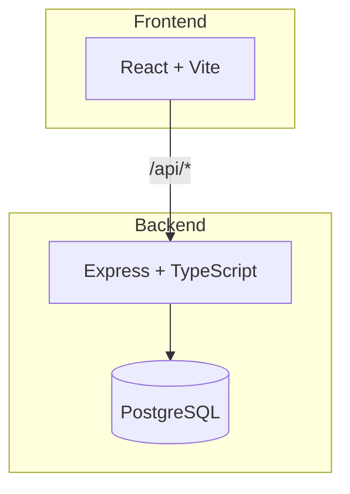

# prompt-website

<!-- maestru:summary -->
Welcome to your new project! This is a full-stack web application built with React, Express, and PostgreSQL.
<!-- /maestru:summary -->

## Architecture



## Structure

| Folder | Purpose |
|--------|---------|
| `apps/web/` | React frontend with Vite and Tailwind CSS |
| `apps/api/` | Express backend with TypeScript |
| `packages/` | Shared code (add as needed) |
| `.maestru/` | Documentation, work tracks, and specs |

## Getting Started

```bash
npm install     # Install dependencies
npm run dev     # Start dev servers (frontend :3000, API :3001)
```

Or use the **Console** tab in Maestru to run these commands.

## Growing Your App

### Adding API Routes

Create a new file in `apps/api/src/routes/`:

```typescript
// apps/api/src/routes/users.ts
import { Router } from 'express';
export const usersRouter = Router();

usersRouter.get('/', async (req, res) => {
  res.json({ data: [] });
});
```

Then register it in `apps/api/src/index.ts`:

```typescript
import { usersRouter } from './routes/users.js';
app.use('/api/users', usersRouter);
```

### Adding Database Tables

1. Create or edit the schema in `apps/api/src/db/schema.ts` using [Drizzle ORM](https://orm.drizzle.team)
2. Generate a migration: `npm run -w apps/api db:generate`
3. Apply the migration: `npm run -w apps/api db:migrate`

Always use `db:generate` + `db:migrate` for migrations — don't edit migration files manually.

### Adding Frontend Pages

Add new components in `apps/web/src/`. For routing, install a router like `react-router-dom` and set up routes in `App.tsx`.

### Adding Shared Packages

Create a new package in `packages/` (e.g., `packages/shared/`) with its own `package.json`. Reference it from apps using the workspace name.

## Configuration

### maestru.yaml

The `maestru.yaml` file at the project root defines processes that Maestru runs:

```yaml
processes:
  setup:
    command: npm install       # runs on project open
  run:
    command: npm run dev       # main dev process
    port: 3000                 # port for Preview tab
```

### Deployment

This project is configured for [Railway](https://railway.app) deployment. Each app has a `railway.toml`:

- `apps/web/railway.toml` — builds and serves the frontend
- `apps/api/railway.toml` — builds and runs the API, runs migrations on deploy

### Environment Variables

Manage environment variables via the **Secrets** tab in Maestru, or edit `.env` files directly:

- `apps/api/.env` — API config (`PORT`, `CORS_ORIGIN`, `DATABASE_URL`)
- `apps/web/.env` — Frontend config (`VITE_API_URL`)

## Links

- [React](https://react.dev)
- [Vite](https://vitejs.dev)
- [Express](https://expressjs.com)
- [Drizzle ORM](https://orm.drizzle.team)
- [Tailwind CSS](https://tailwindcss.com)
- [Railway](https://railway.app)
